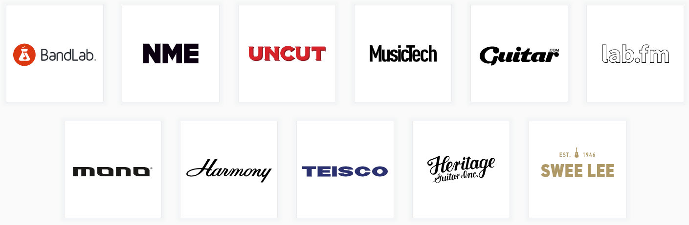

## SECTION 1 : PROJECT TITLE

## BANDLAB Technologies - Order Forecasting System

---

## SECTION 2 : EXECUTIVE SUMMARY

Established in 2016 and headquartered in Singapore, BandLab Technologies is a collective of global music brands that delivers authentic content, products and experiences for all music lovers. By integrating the physical, digital and social supply chain around music, BandLab Technologies brings together remarkable brands and people who are passionate about music, allowing them to leverage opportunities and achieve more together than as individuals.

The group's portfolio spans across digital, media, manufacturing and retail divisions. Its flagship digital product, BandLab, is a social music platform that enables anyone to make music and share their creative process with musicians and fans. Bandlab's brand include the following, some of the household names like Swee Lee and Harmony which Singaporeans have been associated with since young

#### THE PROBLEM STATEMENT

Besides their own brands, the company currently also handles over 200 brands and 16,000 products. Procurement of stocks are usually done monthly. Currently, forecasting of sales order are done monthly using Excel. This is not only time-consuming with the number of products but the forecasted accuracy is also far from ideal. The company is looking at ways where they can better forecast the sales. This is where we come in.

#### OUR PROPOSAL

1. The system will be a complete pipeline from ingesting raw data from the database and writing back processed data back to the DB. The web application will be able to draw from the processed database to display and to decide.
2. To develop several forecasting models and select the best for the company to use for their application. The recommended model will be selected based on the lowest Maximum Absolute Error (MaxE) and the lowest Root Mean Squared Error (RMSE).
3. To extract insights from the historical transaction data to provide recommendations for products bundling during marketing promotions and making post sales recommendations to previous customers. We will make use of associative mining techniques to accomplish this objective.

---

## SECTION 3 : CREDITS / PROJECT CONTRIBUTION

| Official Full Name | Student ID | Work Items (Who Did What)        | Email (Optional)       |
| :------------------- | :----------: | :--------------------------------- | :----------------------- |
| YAP Pow Look       | A0163450M | • Knowledge Discovery • Forecasting Models • Project Manager| e0147014@u.nus.edu |
| CHOW Kok Peng      | A0195403H | • Knowledge Discovery • System Design • Product Recommendation | e0385034@u.nus.edu    |
| TAN Nicole Ongoco  | A0229980R | • Data Acquisition • Web Application • System Architecture| e0687388@u.nus.edu  |
| NGUYEN Minh Tien   | A0229981N | • Data Preprocessing • Product Recommendation • Deployment| e0687389@u.nus.edu   |

---

## SECTION 4 : VIDEO OF SYSTEM MODELLING & USE CASE DEMO

---

## SECTION 5 : USER GUIDE

Refer to `Appendix 4 <Installation & User Guide>` in project report at Github Folder: [ProjectReport](ProjectReports/Project%20Report%20-%20Order%20Forecasting.pdf)

---

## SECTION 6 : PROJECT REPORT / PAPER

Refer to Github Folder: [ProjectReport](ProjectReports/Project%20Report%20-%20Order%20Forecasting.pdf)

---
