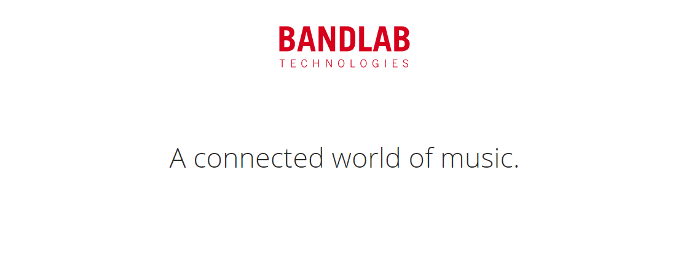

## SECTION 1 : PROJECT TITLE

## BANDLAB Technologies - Sales Forecasting System

---

## SECTION 2 : EXECUTIVE SUMMARY

Established in 2016 and headquartered in Singapore, BandLab Technologies is a collective of global music brands that delivers authentic content, products and experiences for all music lovers. By integrating the physical, digital and social supply chain around music, BandLab Technologies brings together remarkable brands and people who are passionate about music, allowing them to leverage opportunities and achieve more together than as individuals.

The group's portfolio spans across digital, media, manufacturing and retail divisions. Its flagship digital product, BandLab, is a social music platform that enables anyone to make music and share their creative process with musicians and fans. Bandlab's brand include the following, some of the household names like Swee Lee and Harmony which Singaporeans have been associated with since young

#### THE PROBLEM STATEMENT

Besides their own brands, the company currently also handles over 200 brands and 16,000 products. Procurement of stocks are usually done monthly. Currently, forecasting of sales order are done monthly using Excel. This is not only time-consuming with the number of products but the forecasted accuracy is also far from ideal. The company is looking at ways where they can better forecast the sales. This is where we come in.

#### OUR PROPOSAL

We will create a Web Application which will:
   1. Forecast Orders per Product SKU (which will help with stock procurement)
      We will develop several models from general rolling moving average to statistical timeseries to deep learning models utilising LSTM techniques. We will select the best model in performance comparison
   2. Besides forecasting, the application will also do a Marketing Basket Analysis to identify products to recommend from those    
      already purchase. This may help the sales department to better plan their marketing campaign

---

## SECTION 3 : CREDITS / PROJECT CONTRIBUTION

| Official Full Name | Student ID | Work Items (Who Did What)        | Email (Optional)      |
| :----------------- | :---------------------------: | :------------------------------- | :-------------------- |
| YAP Pow Look       |           A1234567A           | xxxxxxxxxx yyyyyyyyyy zzzzzzzzzz | A1234567A@nus.edu.sg  |
| CHOW Kok Peng      |           A1234567B           | xxxxxxxxxx yyyyyyyyyy zzzzzzzzzz | A1234567B@gmail.com   |
| Nicole TAN Oncogo  |           A1234567C           | xxxxxxxxxx yyyyyyyyyy zzzzzzzzzz | A1234567C@outlook.com |
| NGUYEN Minh Tien   |           A1234567D           | xxxxxxxxxx yyyyyyyyyy zzzzzzzzzz | A1234567D@yahoo.com   |

---

## SECTION 4 : VIDEO OF SYSTEM MODELLING & USE CASE DEMO

---

## SECTION 5 : USER GUIDE

`Refer to appendix <Installation & User Guide> in project report at Github Folder: ProjectReport`

### [ 1 ] To run the system using github

#### Instructions on how to clone the repo and launch the application

### [ 2 ] To run the system in other/local machine using docker

#### Instructions to install docker

---

## SECTION 6 : PROJECT REPORT / PAPER

`Refer to project report at Github Folder: ProjectReport`

---

## SECTION 7 : MISCELLANEOUS

`Refer to Github Folder: Miscellaneous`
